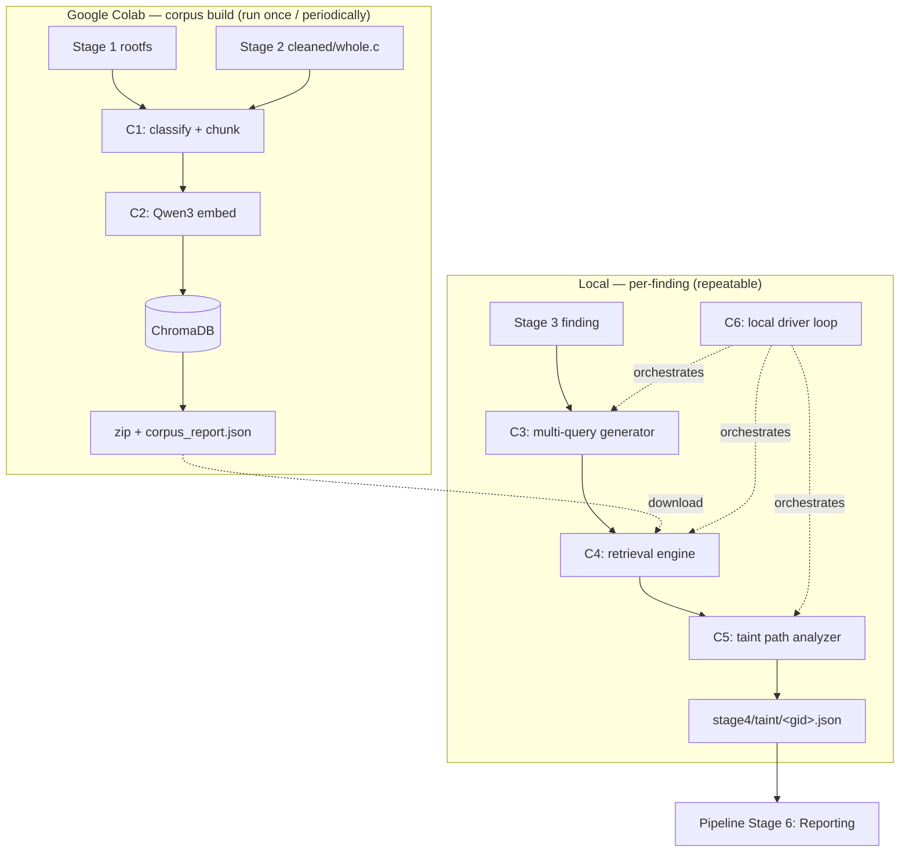

# MASTERPLAN — Stage 4: RAG Sink-to-Source Identifier

**Status:** living document, updated as implementation progresses.
**Scope:** architecture and roadmap for `fw_audit/stage4_rag/`. Component-by-
component, module-by-module — see the milestone roadmap (§13) for build
order.

## 1. Why Stage 4 exists

Stage 3 emits candidate security findings per code chunk, but each report is
**chunk-local**: it names a sink (`strcpy`, `system`, …) and guesses at a
source, then routinely gives up with `decision=CONTEXT_REQUIRED` and a
`missing_context[]` list, because the caller, the global, or the NVRAM key
that feeds the sink lives in a *different* file — often a different binary,
or the web UI.

Stage 4 closes that gap: take Stage 3's sinks and trace data flow
**backward** to real sources (NVRAM, HTTP params, network, IPC, files)
across the whole firmware, using retrieval-augmented context assembly.

## 2. Deployment model

Corpus-heavy work (chunking + embedding + vector indexing) runs **once, in
a Google Colab notebook** (free GPU, zero local install burden). Per-finding
reasoning (query generation, retrieval, taint analysis) runs **locally**
against a downloaded copy of the resulting vector store.



## 3. Input contracts

**File classifier** (canonical copy in `colab/chunk_and_embed.py`, see §5):
- `ALLOWED_TEXT_EXTENSIONS`: `.html .htm .asp .aspx .js .css .txt .xml .json .conf .cfg .ini .sh .php .cgi .lua`
  — strict allow-list; a file whose extension isn't in this set is never
  ingested, no printable-byte heuristic fallback for unlisted/extensionless
  files.
- ELF magic-byte guard (`\x7fELF` prefix) — backstops the allow-list itself
  for a binary hiding under a misleading text-like extension.
- Stage 2's cleaned decompiled C (`cleaned/whole.c` per binary) is
  **excluded from the corpus by default** — opt in via
  `Settings.stage4_include_decompiled_c` /
  `FWA_STAGE4_INCLUDE_DECOMPILED_C=true`.

**Stage 2 cleaned artifacts** — `stage2/binaries/<bin_id>/cleaned/whole.c` +
`cleaned/functions.json` (per-function `{name, start_line, end_line}`
index, spans relative to `whole.c`). Resolved via `stage2_summary.json`'s
`binaries[].artifacts.cleaned_c` / `.cleaned_index_json` fields — never
re-run tree-sitter.

**Stage 3 finding/sink resolution** (`sink_index.py`) — must survive Stage
3's missing summaries (`stage3_summary.json`/`analysis_summary.json` are
best-effort writes and frequently absent):
- Primary: glob `stage3/findings/*.json`; recover `chunk_id` via filename
  `__` → `#`.
- `bin_id` from the `chunk_id` prefix (`<bin_id>#<ordinal:04d>`).
- Global id: `f"{chunk_id}::{finding_id}"` — `Finding.finding_id` is unique
  only *within* a chunk.
- Default selection: `decision ∈ {ESCALATE, CONTEXT_REQUIRED}`, configurable.

## 4. Component map

| Component | Where it runs | Responsibility |
|---|---|---|
| C1 — Chunking | Google Colab | Classify rootfs + cleaned-C files, split into ~500-word chunks |
| C2 — Vector store + embedding | Google Colab | Embed chunks (Qwen3), upsert into ChromaDB, package for download |
| C3 — Multi-query generator | Local | LLM turns a Stage 3 finding into 4-5 targeted search queries |
| C4 — Retrieval engine | Local | Embed queries, top-k search Chroma, build the C5 prompt |
| C5 — Taint path analyzer | Local | LLM reconstructs a taint path from retrieved context, fixed schema output |
| C6 — Local driver | Local | Loops findings through C3→C4→C5, persists results, no synthesis |

## 5. C1 — Chunking (Google Colab)

`fw_audit/stage4_rag/colab/chunk_and_embed.py` is **dependency-light**
(stdlib + `chromadb` + embedding lib only, **zero `fw_audit.*` imports**) so
this one file is simultaneously the repo's source of truth *and*
paste-able into a Colab cell verbatim.

Contains: the file classifier (§3), a `ChunkStrategy` Protocol with one v1
implementation — `FixedWordChunker` (~500 words/chunk, no overlap by
default) — Chroma setup, the Qwen3 embedding wrapper, the embed+upsert
loop, and a zip/package helper.

A companion `.ipynb` wraps the same script in narrative cells: install,
upload/Drive-mount instructions, run, download.

**v1 is deliberately basic.** One uniform chunking strategy across every
file type, regardless of whether it's C, HTML, or shell script. A smarter,
content-aware strategy (function-boundary-aware for C, template-block-aware
for `.asp`, etc.) is a documented future iteration, not built now — the
`ChunkStrategy` interface exists precisely so it can be swapped later
without touching C2–C6.

## 6. C2 — Vector store + embedding (Google Colab)

- **ChromaDB**, `PersistentClient`, one collection per corpus build
  (`stage4_<db_subfolder_stem>`).
- **Qwen3 embedding family** (user-specified 3B-parameter tier — exact HF
  repo id pinned at implementation time, see Risks §14).
- Metadata per chunk: `source_path`, `kind` (`DECOMPILED_C` /
  `ROOTFS_TEXT`), `bin_id` (if applicable), `chunk_id`, `ordinal`.
  Content-hash ids for idempotent re-embedding.
- Output: zipped Chroma dir + `corpus_report.json` (files classified,
  chunk/embedding counts, model used) — both downloaded and placed under
  local `stage4/`.

## 7. C3 — Multi-query generator (local)

- New `AgentRole.STAGE4_QUERY_PLANNER`; dual-provider via the existing
  `resolve_spec()` routing, overridable via `FWA_STAGE4_QUERY_PLANNER_MODEL`
  — same pattern as `FWA_STAGE3_ANALYST_MODEL`. Supports local Ollama
  (dev/testing) and Anthropic Claude Sonnet (production).
- **No tool access** — same "zero execution/filesystem access" discipline
  as Stage 1's Identifier Agent.
- `query/prompts.py` — system prompt is a clearly marked **placeholder**
  block reserved for the user's specialized prompt content.
- Schema, structured-output enforced (`with_structured_output`,
  schema-repair retry mirroring `stage3_analysis/agent/analyst.py`):
  ```
  SearchQuery{query_text: str, focus: str}
  MultiQueryPlan{finding_id: str, queries: list[SearchQuery]}  # 4-5 entries
  ```

## 8. C4 — Retrieval engine (local)

- Precondition: local Chroma dir present (unzipped from the Colab
  download) — C4 does not run before a vector store exists locally.
- Embeds each C3 query using the **same Qwen3 model, run locally** — this
  is a hard requirement, not optional (see Risks §14).
- Top-k similarity search per query (`FWA_STAGE4_TOP_K`, default 8), light
  merge/dedupe by chunk id. **No hybrid/symbol/call-graph fusion in v1** —
  flagged as a documented future iteration.
- `build_c5_prompt(retrieval_bundle, stage3_finding) -> str` implements the
  exact formula specified: **retrieved context (C4) + query (C3) + the
  original Stage 3 finding**.

## 9. C5 — Taint path analyzer (local)

- New `AgentRole.STAGE4_TAINT_ANALYST`, same dual-provider pattern,
  `FWA_STAGE4_TAINT_ANALYST_MODEL` override.
- **No tool access.**
- `taint/prompts.py` — system prompt placeholder, reserved for user content.
- **Output is a fixed, schema-enforced contract via LangChain's
  `with_structured_output()` — for both providers, never prompt-engineered
  formatting.** This mirrors `common/findings.py`'s documented precedent:
  prose-only format enforcement was tried for the Stage 1 Identifier Agent
  and abandoned as unreliable at small model sizes.
- New `common/taint.py`:
  ```
  class SourceClass(str, Enum):
      NVRAM | HTTP_PARAM | NETWORK | IPC | FILE | CLI | ENV | CONST | UNKNOWN

  class TaintStep(BaseModel): description, file_ref, function_ref, code_evidence
  class TaintPath(BaseModel): steps: list[TaintStep], source_class: SourceClass,
                               attacker_control: str, confidence: str, completeness: str
  class TaintPathReport(BaseModel): finding_ref, paths: list[TaintPath],
                                     verdict: str, unresolved_gaps: list[str]
  ```
- This is the artifact handed to pipeline **Stage 6 (Reporting)**.

## 10. C6 — Local driver / runner

Descoped from the original "Orchestrator & Report Synthesizer" concept: no
LangGraph state machine, no hop-budget/gap-requery loop, no report
synthesis. Just a thin async driver:

1. Select findings via `sink_index.py` (`decision ∈ {ESCALATE,
   CONTEXT_REQUIRED}` by default).
2. For each: C3 → C4 → C5, persist `stage4/taint/<gid>.json`.
3. Worker-pool concurrency, same shape as Stage 3's `chunk_queue.py`.
4. Write `stage4/stage4_summary.json` — run bookkeeping only
   (counts/statuses/errors), **not** a synthesized audit report. Final
   cross-finding synthesis is pipeline Stage 6's job.

> **Open item:** "supplied to stage 6 (reporting module)" is read here as
> the *pipeline's* Stage 6, not an internal Stage 4 synthesis step. Flagged
> for confirmation — see Risks §14.

## 11. New schemas

- `common/schemas.py` ← optional `CorpusKind` enum (`DECOMPILED_C`,
  `ROOTFS_TEXT`) for Chroma metadata tagging only.
- `common/taint.py` (new) ← as in §9, plus `Stage4RunSummary` for the
  driver's own bookkeeping.

## 12. Output layout — `<db_subfolder>/stage4/`

```
stage4/
  chroma/                  <- unzipped from Colab download
  corpus_report.json       <- from Colab (files classified, chunk/embed counts, model)
  queries/<gid>.json       <- C3 output
  retrieval/<gid>.json     <- C4 output
  taint/<gid>.json         <- C5 output (fixed schema)
  stage4_summary.json      <- C6 driver run summary
```

Pure `layout.py` path algebra, `::`→`__` filename sanitizing, no I/O — same
discipline as Stage 3's `layout.py`.

## 13. Config, packaging, and milestones

New `FWA_STAGE4_*` `Settings` fields: `stage4_chunk_words` (default 500),
`stage4_chroma_path`, `stage4_embedding_model`, `stage4_top_k`,
`stage4_workers`, `FWA_STAGE4_QUERY_PLANNER_MODEL`,
`FWA_STAGE4_TAINT_ANALYST_MODEL` — each with explicit `validation_alias`.

`pyproject.toml`: new `[stage4-local]` extra (`chromadb` client + local
embedding lib); `fw-trace = "fw_audit.stage4_rag.runner:main"`. The Colab
notebook carries its own separate `!pip install` cell — never part of the
package's own extras.

| ID | Milestone | Deliverables | Test file |
|---|---|---|---|
| **C0-M1** | Package skeleton | `stage4_rag/`, `layout.py`, `errors.py` | `test_stage4_layout.py` |
| **C0-M2** | Sink index (summary-free) | `sink_index.py`, `SinkCandidate`, global ids | `test_stage4_sink_index.py` |
| **C1-M1** | File classifier + fixed-word chunker | `colab/chunk_and_embed.py` | `test_stage4_classifier.py`, `test_stage4_chunking.py` |
| **C1-M2** | Colab notebook wrapper | `.ipynb` narrative cells | manual Colab smoke run |
| **C2-M1** | Chroma + Qwen3 embedding setup | embedding wrapper, Chroma setup, in `chunk_and_embed.py` | manual Colab smoke run |
| **C2-M2** | Embed+upsert+package pipeline | content-hash ids, zip + `corpus_report.json` | ″ |
| **C3-M1** | Query schemas + AgentRole | `SearchQuery`/`MultiQueryPlan`, `AgentRole.STAGE4_QUERY_PLANNER` | `test_stage4_query_schema.py` |
| **C3-M2** | Planner + prompt placeholder | `query/prompts.py`, `query/planner.py` | `test_stage4_query_planner.py` |
| **C4-M1** | Local Chroma client + query embedding | `retrieval/store.py`, local embedder | `test_stage4_retrieval_store.py` |
| **C4-M2** | Top-k search + merge/dedupe + prompt builder | `retrieval/engine.py`, `build_c5_prompt()` | `test_stage4_retrieval_engine.py` |
| **C5-M1** | Taint schemas | `common/taint.py` | `test_stage4_taint_schema.py` |
| **C5-M2** | Analyzer + prompt placeholder + repair retry | `taint/prompts.py`, `taint/analyst.py` | `test_stage4_taint_analyst.py` |
| **C6-M1** | Local driver loop | `driver.py` | `test_stage4_driver.py` |
| **C6-M2** | Run summary + CLI + docs | `Stage4RunSummary`, `runner.py`, `fw-trace` entry, docs | `test_stage4_runner.py` |

**Build order:** `C0 → C1+C2 (Colab, independent of local code) → C3
(parallel, depends only on schemas) → C4 → C5 → C6`.

## 14. Risks & open decisions

- **Component 6 interpretation:** read as pipeline Stage 6 — Stage 4 stops
  at structured `taint/<gid>.json` artifacts, no internal synthesis.
- **Embedding parity:** the local machine must run the *identical* Qwen3
  checkpoint used in Colab so C3's queries land in the same vector space —
  a real local compute/weight requirement, not optional. Exact HF repo id
  to be pinned at implementation time.
- **Ollama structured-output reliability** varies by local model — C3/C5
  must pick function-calling/JSON-schema-capable Ollama models (same
  constraint Stage 3's analyst already solved via `agent/analyst.py`'s
  retry pattern).
- Text/binary classifier is extension + magic-byte heuristic — may
  misclassify unusual firmware-specific formats; best-effort, iterate later.
- v1 chunking (fixed 500-word) and v1 retrieval (plain top-k, no hybrid
  fusion) are intentionally basic — hybrid symbol/call-graph retrieval and
  smarter chunking remain documented future iterations.
- The real findings sample has `findings: []` for most analyzed chunks —
  synthetic fixtures are required for end-to-end local testing (C3–C6).
